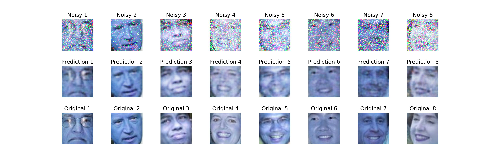

#  Fully convolutional network for image denoising

## Preview

This project demonstrates a visualization of image predictions using a trained model. The steps involved are:

1. **Dataset Preparation**:
   - A dataset of face images is used as the starting point. Data can be downloaded [here](https://conradsanderson.id.au/lfwcrop/lfwcrop_color.zip).

2. **Adding Noise**:
   - Gaussian noise is added to the images to create noisy versions.

3. **Model Creation**:
   - An encoder-decoder fully convolutional network is created to denoise the images.

## Tags

- CNN
- Keras
- Image Denoising
- Gaussian Noise
- Encoder-Decoder Network
- Computer Vision
- Deep Learning
